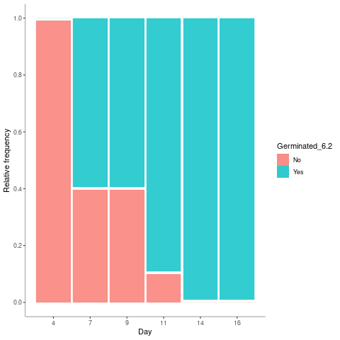
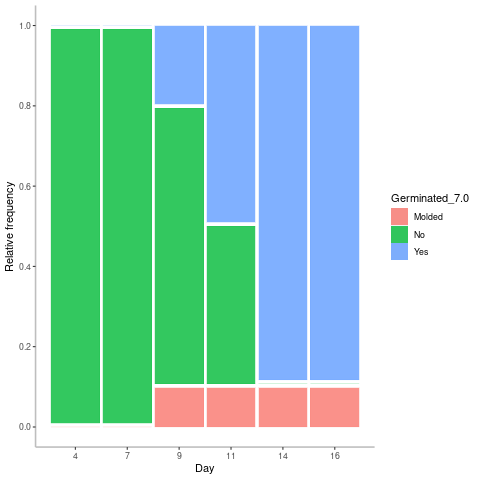
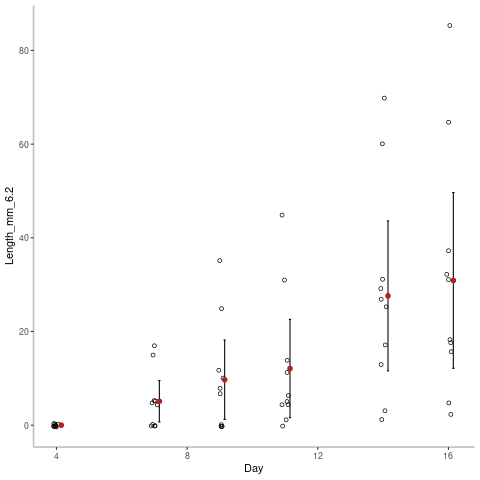
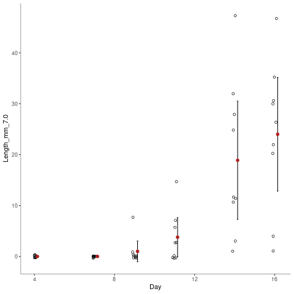

```{r setup, include=FALSE}
knitr::opts_chunk$set(echo = FALSE) # sets echo = FALSE as a default
library(readr)
library(dplyr)
Ex_Data <- read_csv("../example_data/Kendal-Freedman_BIOL125_Example.csv", show_col_types = FALSE)
Summary_Stats <- read_csv("../analysis/Kendal-Freedman_BIOL125_Analysis.csv", show_col_types = FALSE)
```

# Abstract

This report covers how pH effects the growth and germination of Mung Beans (*Vigna radiata*). Mung beans are widely grown across much of South America, Africa, Australia and Southeast Asia, and are considered to be a very important food source. In this report we cover the methods we use to determine the pH range for effectively growing Mung Beans.

The experimental portion of this report was carried out of a period of 16 days to ensure plenty of time for the germination of mung beans and growth to find a pattern. Each pH sample used was assigned an equal number of beans to limit variance. To limit extenuating factors, during the germination period, no light was provided to the beans, and a 0 salinity neutral water solution spray was used to provide water, with pre-prepared pH solutions used to set the pH.

We analyzed our data using a Welch Two Sample t-test for the difference of means with unequal variance, and determined that a pH range of 6.2 to 7.2 is suitable for the growth of mung beans. It was also found there was no significant difference in other key measurements between the samples. As such, we recommend the site is suitable for the growth of Mung Beans.

# Data Availability Statement

Data is available as a supplementary file in `.csv` format.

# Introduction

This report was created to explain the results of testing the germination and growth rate of mung beans under different pHs. Understanding how different soil situations can affect the growth rate and germination of seeds based on soil conditions. Tuan et al. (2019) outlines that understanding the germination process of seeds and what effects it is very important, and how they can impact crop yield and quantity. Germination and the following growth over the next few weeks is a crucial time in the life of a plant, it is where a plant can either thrive, or die. Seeds require a very specific set of conditions to grow, and understanding what those conditions are and being able to maximize them to get optimal yields and quantity is important in a world with a growing overpopulation.

Maskun et al. (2021) shows how the pandemic has accelerated a growing food crisis in Third-World Countries and that the agricultural sector needs to be able to increase its food production and density to feed and provide growing populations and maintain food security. One way to increase food security is by increasing production dentistry of food in current agricultural lands by examining how different crops react to different soil types and soil properties. One such soil property that can have great impact on the germination and growth of crops is the pH level of the soil, as pH impacts how different reactions can occur, and allow and block other reactions.

This report focuses on the effects of pH for a few reasons, namely, the farmland site that was requested by Elliot to be analyzed for Mung Bean farming has the widest range of variance in soil quality with pH, a range of 6.2 to 7.2, and as such pH was chosen to the for focus of this study. Laghmouchi et al. (2017) finds that every plant has an optimal range of pH for it germinate in, any pH lower than that range (too acidic), or higher (too basic) suppressed the germination of the seeds. Furthermore, it was found that there was not a single pH for which seeds had a 100% chance to germinate at, but that the inhibitory effects of pH outside the optimal range was due to inhibitory effects on the catalysts involved in the germination process. pH further has an effect on the germination and growth of plants because it effects the solubility of nutrients in water, and it can effect the growth of other plants which can create the nutrients needed for the further growth of the main crop, like crop rotation, so that an area doesn't get completely drained of nutrients.

However, you cannot plant any seed that provides the nutrient return needed and expect it to work for crop rotations, it too has its own range of pHs it tolerates, and as such, the effects of pH have to be analyzed on a number of different plants. This report did not have the timeframe, knowledge, expertise, and tools to analyze the effect of pH on crop rotation, so the main crop to be planted at the site in question was chosen to be analyzed, and as such, the report focuses on mung beans, and specifically the effects of pH on the germination and initial growth of mung beans.

In this report, we set out to answer how pH impacts the germination and initial growth of mung beans over the first 16 days from planting them. It was hypothesized that a pH around 7.0 would lead to a better rate of germination and growth in mung beans than a pH around 6.2.


# Methods

To eliminate sampling and genetic bias in mung beans to get a valid dataset, a set of 20 mung beans were selected from a large group of over 500 beans. The 20 selected beans were then randomly assigned using random number assignment to be treated with either pH of 6.2, or pH of 7.0. Each bean in each group was then assigned a number 1 through 10 to keep track of it throughout the duration of the experiment without confounding it with another bean. Each bean got a separate section of paper towel to germinate and grow in, labelled with its number.

Each section of paper towel was prepared using the following method: Each section was first labeled with the number ofr its associated bean, then indirectly sprayed with a neutral water solution to dampen the paper towel and then 1 drop of the appropriate pH solution was added to the paper to change the pH appropriately. The mung bean was then placed inside the paper, and it was folded over to simulate the mung bean being surrounded by dirt. Each section was then put into a plastic bag grouped with the other of the same pH which was then partially closed and wrapped in aluminum foil to block out light. The bags were not completely sealed as to still allow airflow in and out of it.

When the beans were measured, the germination state and length were separately recorded into two comma separated files where germination was recorded as a categorical `Yes`/`No`, with an optional `Molded` state to apply if a bean had molded and had to be discarded early. A millimeter level precision ruler was used to record the length of the root on each bean, approximated to the $10^{th}$ of a millimeter. For molded beans, the length for the bean was left blank. Data was recorded using the following example schema, first for length, and then for germination.

```{r, echo=FALSE}
knitr::kable(head(Ex_Data), caption = "Example data collection")
```


# Results

Looking first at the germination rates of the mung beans in different pHs in Figure 1, it shows that all beans eventually germinated, including the one bean that did mold, however that bean stopped being tracked after it molded. The beans in the 7.0 pH took longer to start germinating, but once they started germinating, the beans in pH 7.0 germinated at a similar rate to the beans in the pH 6.2.

```{r Germination, echo=FALSE, fig.show='hold', fig.align='center', fig.cap="From Left to Right, relative frequency of germination over time for mung beans in pH 6.2 and 7.0 in the top row, n=10 for pH 6.2 and n = 9 for pH 7.0.", out.width = '33%'}


```


Further, looking at the length of the beans shown in Figure 2, a few beans are observed to grow to a very long length in the pH 6.2 environment of greater 60 mm in length. However, looking at the means of both over time shows that the mean values are approximately equal throughout the experiment. Both the ph 6.2 and pH 7.0 environments have relative equal length error bars, and a relatively even distribution of lengths.

```{r Length, echo=FALSE, fig.show='hold', fig.align='center', fig.cap="From Left to Right, strip-chart of the growth of mung beans in an environment of pH 6.2 and 7.0 respectfully, with the same n=10 for pH 6.2 and n=9 for pH 7.0 as for the relative frequency plots.", out.width = '33%'}


```

Looking at the summary statistics of the final day measurements in Table 3 shows that the medians are equal within reasonable error, and there is a much lower deviation from the mean for beans in the ph 7.0 environment, where the median is actually higher for pH 7.0. The beans in ph 6.2 environment tended to have more extreme growth values, and this was observed in the almost double Standard deviation and Inter-quartile range of the pH 6.2 environment compared to the pH 7.0 environment.


```{r, echo=FALSE}
sum_stats <- head(Summary_Stats)
knitr::kable(sum_stats, caption = "Summary Statistics for final mung bean root length.")
```

# Discussion & Recommendations

To analyze the resulting data, a Welch Two Sample t-test for the difference in means was used, and looking at a 2-sample T test of the final day length vs pH gives us a t-value of 0.7045, 14.42 degrees of freedom and a p value of 0.4923, a confidence interval -13.82286 to 27.40064 we cannot reject the null hypothesis that the difference between the groups are equal. Given that we cannot reject the null hypothesis, we can interpret this to mean that there is no meaningful difference in germination rates or growth rate at pH 6.2 and pH 7.0.

With this resulting conclusion from the t-test, it is determined that the property is suitable for the growth of mung beans given the reported pH range for the arable land on site is 6.2 to 7.2 pH and that no meaningful difference was found in growth between pH 6.2 to 7.0.

Oplinger et al. (1997) found that the ideal pH for mung bean growth is 6.2 to 7.2, with more alkaline soils allowing for some micronutrient deficiencies and for severe iron chlorosis symptoms to develop. This finding agrees with our assessment that a pH range of 6.2 to 7.0 has no meaningful different in the successful growth and germination of mung beans.

The determination on pH found in Oplinger et al. (1997) that a pH range of 6.2 to 7.2 reinforces the result and recommendation we found in our experimentation on mung beans, and confirms that Site 3 is a suitable location to plant mung beans. We do caution as per our observations and the findings of the aforementioned report to monitor the pH and be prepared to add alkaline or acidic treatments to keep the pH within the suitable range for growth of Mung Beans, if necessary.

Furthermore, this report only focuses on the effects of pH on the germination and growth of mung beans, we would recommend further analysis of salinity, regional temperature, seasonal weather, and daily hours of light at the location before making a final decision on growing Mung Beans at Site 3. The pH on location may be within range, but other environmental conditions, inclusion but not limited to the aforementioned ones may make the site unsuitable for the growth of Mung Beans. As an example, Oplinger et al. (1997) found that Mung Beans need 90 to 120 frost free days depending on the exact strain to go from planting to maturity.

\clearpage

# References

Pham Anh Tuan, Menghan Sun, Tran-Nguyen Nguyen, Seokhoon Park, Belay T. Ayele (2019). 1 - Molecular mechanisms of seed germination. Sprouted Grains, *AACC International Press*. [https://doi.org/10.1016/B978-0-12-811525-1.00001-4](https://doi.org/10.1016/B978-0-12-811525-1.00001-4).

Maskun, A. Ilmar,  Naswar,  Ahmad, Marthen Napang, Rian Nugraha (2021). The state responsibility on food availability on the pandemic. *Gaceta Sanitaria*, Volume 35, Supplement 2, S345-S347. [https://doi.org/10.1016/j.gaceta.2021.10.049](https://doi.org/10.1016/j.gaceta.2021.10.049).

Yousif Laghmouchi, Omar Belmehdi, Abdelhakim Bouyahya, Nadia Skali Senhaji, Jamal Abrini (2017). Effect of temperature, salt stress and pH on seed germination of medicinal plant Origanum compactum. *Biocatalysis and Agricultural Biotechnology*, Volume 10, 156-160. [https://doi.org/10.1016/j.bcab.2017.03.002](https://doi.org/10.1016/j.bcab.2017.03.002).

E.S. Oplinger, L.L. Hardman, A.R. Kaminski, S.M. Combs, J.D. Doll (1997, November 21). *Mungbean* [https://hort.purdue.edu/newcrop/afcm/mungbean.html](https://hort.purdue.edu/newcrop/afcm/mungbean.html).
